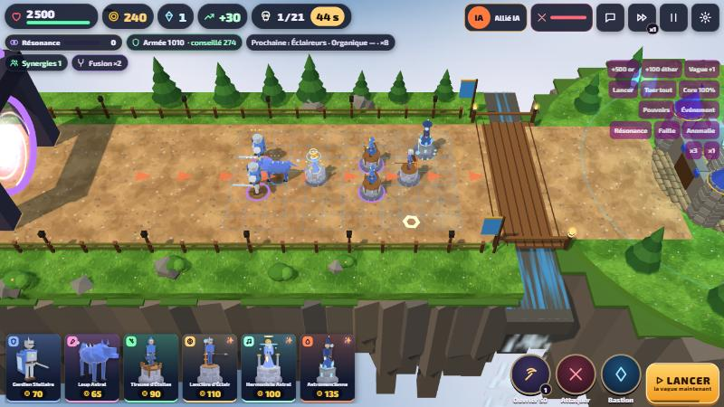
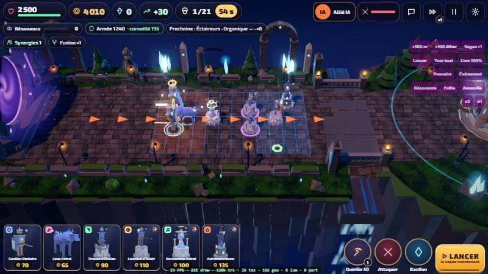
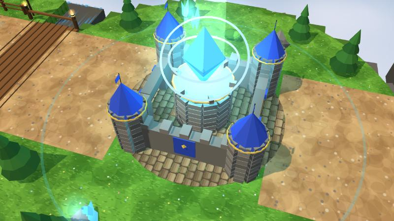
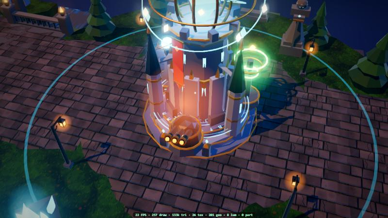
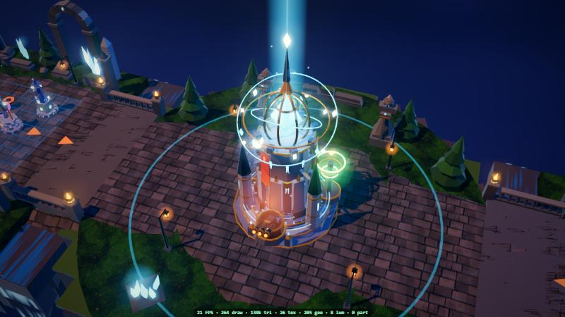
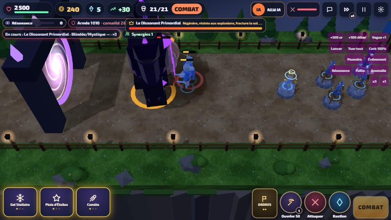
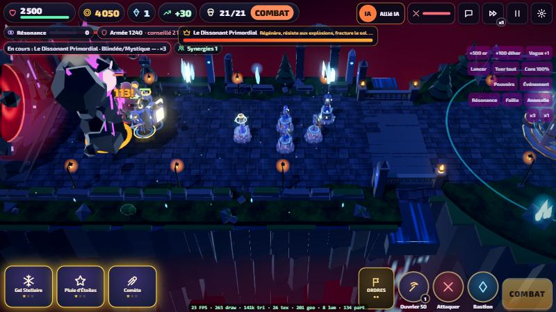
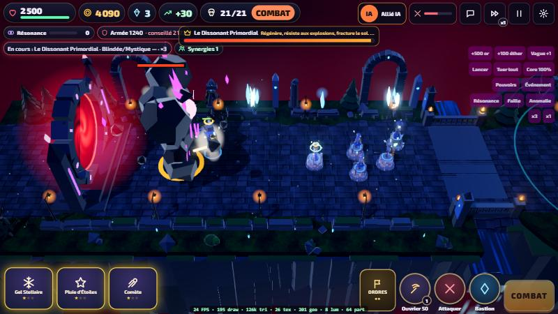

# DUO BASTION v0.5 « Crépuscule » : refonte graphique

Version 0.5.0-alpha. Moteur inchangé (Three.js r169 + Vite) : tout est procédural, aucune image de référence n'est utilisée dans le jeu, aucun asset payant.

## 1. Analyse des images de référence

Les trois planches montrent une **fantasy / sci-fi cinématique**. Ce que j'en ai retenu pour le jeu :

- **Lumière** : ambiance de crépuscule ou de nuit bleutée, avec des sources chaudes et des matières lumineuses (cristaux, runes, lave) qui « débordent » (halo). Fort contraste chaud/froid.
- **Monuments verticaux** : une forteresse haute, en pierre et métal doré, avec un réacteur de cristal au sommet, plusieurs étages et des anneaux animés.
- **Décors denses mais lisibles** : ruines, arches, statues, murets, lanternes et végétation autour d'un chemin dégagé. La profondeur vient de la brume et de l'abîme sous les îles.
- **Identité forte par faction** : une couleur dominante, un matériau et un effet propres à chacune (cristaux et étoiles, engrenages et vapeur, racines et spores, corail et bulles, lave et braises, os et âmes).
- **Boss massifs** avec une énergie interne visible (fissures, noyau, aura) qui évoluent au fil du combat.
- **Interface sombre et vitrée**, avec liserés dorés.

## 2. Direction artistique choisie : « crépuscule cinématique »

- **Palette** : ombres bleu nuit et sarcelle, lumière principale chaude et rasante, contre-jour froid. Les sources lumineuses sont rendues en HDR, donc l'effet de halo ne prend que ce qui doit briller.
- **Matières** : pierre mate, or semi-métallique, cristaux émissifs, et la couleur propre à chaque faction.
- **Règles de lisibilité**, vérifiées par des tests automatiques :
  - le champ de bataille reste plat et dégagé ;
  - le décor se place sur les bords et au fond ;
  - le côté proche de la caméra reste bas ;
  - les unités ont un liseré froid qui les détache des dalles sombres.
- **Heure du jour** : elle avance avec les vagues (crépuscule, heure bleue, nuit magique, nuit profonde). Les vagues de boss rougissent le ciel et les portails.

## 3. Fichiers

**Nouveaux fichiers**
- `src/render/look.ts` :
  - post-traitement : HDR, halo lumineux (bloom), ACES, étalonnage, vignette, FXAA ;
  - reflets (environment map) réservés aux éléments qui en ont besoin ;
  - matériau métal/rugosité défini par sommet ;
  - niveaux de matériaux selon la qualité ;
  - compteur de performance.
- `src/render/bastion.ts` : le Bastion monumental et ses modules.
- `src/render/terrain.ts` : kit de terrain (chemin, murets, lanternes, ruines, statues, pont) et décor par faction.
- `tests/v05.test.ts` : 7 tests.
- `docs/captures/` : captures avant/après.

**Fichiers modifiés**
- `src/render/environment.ts` (réécrit), `Renderer.ts`, `characters.ts`, `shapes.ts`, `towers.ts`, `textures.ts`, `fx.ts`.
- `src/data/enemies.ts` (modèle du Primordial) et `types.ts`.
- `src/ui/styles.css`, `src/config.ts`, `public/sw.js`.

## 4. Le Bastion

- **Base et tour** :
  - trois paliers octogonaux cerclés d'or, avec un cercle de runes au sol qui tourne ;
  - une tour gothique à contreforts et fenêtres lumineuses ;
  - trois flèches reliées par des arcs-boutants.
- **Réacteur** :
  - une cage dorée en lanterne autour du cristal ;
  - anneaux en orbite, éclats de runes et colonne de lumière ;
  - particules qui montent.
- **État du Core** : les fenêtres et les runes faiblissent quand il perd des PV.
- **Modules** : chaque module change la silhouette.
  - Il a sa propre forme selon la famille : tourelle à canons, lance de cristal, bobine Tesla, anneaux d'onde, dôme d'égide, fontaine, enclume, trésor, cristaux de givre, portail, obélisque enchaîné.
  - Chacun ajoute une **bannière** de la couleur de sa famille.
  - Le module grandit avec son niveau.
  - Deux Bastions équipés différemment se reconnaissent donc de loin.
- **Bastion ennemi** : variante pourpre.
- **Pendant une Résonance**, le Bastion s'embrase : la colonne de lumière, le halo et les runes prennent la couleur de la capacité.

## 5. Unités

- **Signature de faction sur chaque unité** :
  - Astral : épaulières d'argent et étoile en orbite.
  - Rouages : sac en laiton avec engrenage et cheminée.
  - Ronces : épaulières en feuilles, épines et spore de jade.
  - Abysses : crête-nageoire et points bioluminescents.
  - Solaire : épaulières de flammes.
  - Nécrose : pics d'os et âme spectrale.
- **Spécialisations** (niveau 4) : la **voie A** porte une crête de pointes, des lames d'épaule et une arme 30 % plus grande. La **voie B** porte un halo et un anneau d'aura au sol.
- **Progression** : chaque niveau rend l'unité plus grande (+3,5 % par niveau), avec en plus les ajouts existants : armure, cape, couronne, runes.
- **Tours** : palettes refaites d'après la direction artistique. Les toits orange de l'Astral sont devenus argent et bleu.
- **Lisibilité** : liseré froid renforcé sur les unités.
- **Limite** : le maillage de base des humanoïdes reste en « low-poly » stylisé. Il n'a pas été resculpté unité par unité.

## 6. Boss

**Le Dissonant Primordial a son propre modèle.**
- **Corps** : roche noire taillée, posture voûtée, épaules en rochers.
- **Énergie** : un noyau brûle dans une brèche du torse, et des fissures lumineuses parcourent le corps.
- **Décor** : une couronne d'éclats de cristal et des rochers qui flottent en orbite.
- **Effets** : braises, fumée et arcs d'énergie s'échappent du corps.

**Il change d'apparence à chaque phase** (voir `apres_boss_phase1.jpg` et `apres_boss_phase3.jpg`) :
- phase 1 : violet ;
- phase 2 : violet-rouge, avec des ailes de cristal ;
- phase 3 : rouge, avec un noyau chauffé à blanc, un halo ardent, et davantage de fissures, d'éclats et de rochers.

**Pendant une vague de boss**, les grands portails passent au rouge et tournent plus vite.

**Limite** : les autres boss gardent le colosse générique de la v0.4.

## 7. Environnements

**Les îles**
- Chemin en dalles usées, avec relief simulé (normal map) et mousse. Ses bords s'enfoncent de façon irrégulière dans un sol moussu.
- Murets de pierre en ruine, lanternes de fer penchées sur le chemin, touffes d'herbe.
- Au fond : arches, colonnes brisées, statue de gardien à l'épée et pins sombres.
- Côté caméra : rochers, buissons et un arbre mort.

**Les passages et les portails**
- Ponts de pierre avec balustres et braseros, au-dessus des cascades.
- Grands portails de faille : anneau de pierre à runes violettes, vortex double sur fond noir, obélisques et rochers en orbite.

**L'abîme**
- Les falaises sont sombres, avec des racines pendantes, et se fondent dans la brume.
- Mer de nuages et brume teintées selon l'heure.
- Îles lointaines avec des tours éclairées.

**Décor de faction par voie** : chaque voie prend l'armée de son joueur, avec ses particules ambiantes.

| Faction | Décor | Particules |
|---|---|---|
| Astral | flèches de cristal, obélisques d'argent | étoiles flottantes |
| Rouages | engrenages de laiton à demi enterrés, tuyaux de cuivre, évents | étincelles |
| Ronces | racines géantes en arche, cosses de spores | spores |
| Abysses | coraux, bassins lumineux, coquillages | bulles |
| Solaire | éclats d'obsidienne, fissures de lave, braseros | braises |
| Nécrose | tombes gothiques, os, bougies spectrales | âmes |

Les 6 décors ont été vérifiés visuellement et par test (ils n'empiètent jamais sur la voie).

## 8. Effets

**Résonance DUO, une séquence cinématique**
- Pendant la canalisation, des orbes **aux couleurs des deux armées** convergent des deux voies vers le réacteur. La combinaison change donc selon la paire.
- Le Bastion s'embrase et l'image se réchauffe vers la couleur de la capacité.
- À l'impact : un flash plein écran (désactivable dans le confort) et un **glyphe de runes** qui s'étend sur toute l'arène.

**Boss** : braises, fumée et arcs d'énergie, avec un portail rouge pendant sa vague.

**Lisibilité**
- Le halo lumineux a été resserré (moins fort, rayon réduit).
- L'éclat des unités est plafonné, et l'arme ne brille entièrement qu'au niveau 5.
- Les zones télégraphiées rouges, les anneaux d'état et les chiffres de dégâts de la v0.4 restent au-dessus de tout.

## 9. Éclairage

- **Lumières réelles** : une lumière chaude rasante, un contre-jour froid et une lumière d'ambiance.
- **Lumières ponctuelles** : seulement une par Bastion, plus le petit lot d'effets de la v0.4.
- **Le reste est émissif en HDR** : cristaux, runes, lanternes, braseros, lave, vortex. Le halo lumineux se charge de faire briller.
- **Faux volumes** : colonne de lumière du réacteur, halos et brume en sprites.
- **Reflets** : l'environment map procédurale de crépuscule n'est appliquée qu'aux unités, au Bastion, à l'or et à l'eau.

## 10. Optimisations

Toutes les mesures ont été faites avec un **chronomètre GPU** (requêtes de minutage WebGL), sur la même scène figée.

| Mesure | Gain GPU par image |
|---|---|
| Halo lumineux réellement calculé au quart de la résolution (le réglage de résolution était ignoré par Three.js) | important, mais mesuré avec la première méthode, plus bruitée (environ −5 ms) |
| Halo ajouté dans la passe finale, au lieu d'un mélange plein écran supplémentaire | −2,7 ms (15,2 → 12,5 ms) |
| ACES, sRGB et étalonnage fusionnés en **une seule passe** | une passe plein écran en moins (non mesuré isolément) |
| MSAA 4× → 2× | −1,1 ms |
| **Fin du MSAA** (le contexte en faisait même deux), remplacé par un **FXAA** dans la passe finale | −4 à −7,5 ms |
| Reflets retirés des grandes surfaces | −5 ms sur la scène BAS en PBR (14 → 9 ms), environ −1 ms mesuré en ÉLEVÉ |
| BAS : reflets restreints + matériaux Lambert | 16,4 → 7,8 ms entre le prototype et la version finale (méthodes de mesure différentes) |
| MOYEN : PBR seulement sur les héros, Lambert sur les grandes surfaces | 13,9 → 8,6–11,4 ms (même méthode) |
| Falaises et touffes d'herbe exclues des ombres | non mesuré isolément |

- **MSAA et FXAA** : l'anticrénelage matériel (MSAA) multipliait par plusieurs le volume de pixels à écrire. Le FXAA lisse les bords dans la passe finale pour un coût minime.
- **Reflets** : l'environment map d'ambiance n'est plus calculée sur le sol, le chemin ni les rochers. C'est la lumière d'ambiance (hémisphérique) qui les éclaire désormais.
- **Moins de brume transparente**, ce qui réduit la superposition de transparences.

**Déjà en place depuis la v0.4** :
- géométrie fusionnée par matériau ;
- unités dessinées en lots (instanciation) ;
- réutilisation des particules, projectiles, éclairs et zones au sol (pooling) ;
- culling par objet.

**Niveau de détail selon la qualité** : nombre de particules, couches de brume, oiseaux, matériaux, ombres et résolution du halo.

**Compteur de debug** (`?debug`) : FPS, appels de dessin, triangles, textures, lumières, particules.

## 11. FPS avant / après

**Conditions de mesure**
- PC portable avec Intel UHD (GPU intégré), 1280×720, densité de pixels 1.
- Même scène figée par la pause : armée Solaire, 8 unités dont une de niveau 5 (voie A) et une de niveau 4 (voie B), 3 modules.
- Builds de production : v0.4 en ligne et v0.5 locale.
- Images enchaînées sans pause, pour garder le GPU à pleine fréquence.
- Mesure GPU sur une centaine d'images.
- Les deux runs d'un même niveau varient parfois de ±2 ms (fréquence variable du GPU intégré) : je donne la fourchette.

| Qualité | v0.4 GPU/image | v0.5 prototype non optimisé* | **v0.5 finale** | ≈ FPS max (GPU) v0.4 → v0.5 | Appels de dessin | Triangles | Textures |
|---|---|---|---|---|---|---|---|
| ÉLEVÉ | 8,5–13,7 ms | ~19,5 ms | **15,5–17,3 ms** | 73–118 → **58–65** | 124 → 217 | 51 k → 124 k | 11 → 26 |
| MOYEN | 6,2 ms | ~18,1 ms | **8,6–11,4 ms** | 161 → **88–116** | 124 → 157 | 51 k → 81 k | 10 → 25 |
| BAS | 5,9 ms | ~16,4 ms | **7,8 ms** | 169 → **128** | 119 → 139 | 51 k → 81 k | 10 → 12 |

\* Prototype mesuré à 30 images/s avant les optimisations, donc pas exactement dans les mêmes conditions.

- **Coût processeur par image** (production, 30 images/s) : environ 4,5–5 ms en v0.4, 5,3–6 ms en v0.5 en ÉLEVÉ et 4,4–4,8 ms en MOYEN.
- **Lecture** :
  - la v0.5 coûte plus cher au GPU, ce qui était attendu avec 2,4× plus de géométrie, le post-traitement et le PBR ;
  - les trois niveaux tiennent les 60 FPS sur ce GPU intégré en 720p, l'ÉLEVÉ étant à la limite ;
  - le MOYEN, réglage par défaut sur téléphone, garde une bonne marge.
- **Non mesuré** :
  - le compteur FPS réel du navigateur : le volet était masqué, donc requestAnimationFrame était ralenti, d'où le chronomètre GPU ;
  - un vrai téléphone : seule la taille d'écran a été émulée.

## 12. Captures comparatives (`docs/captures/`)

| Avant (v0.4) | Après (v0.5) |
|---|---|
|  |  |
|  |  (même cadrage) ·  |
|  |  (même caméra) ·  |

**Autres captures**
- Boss par phase : `apres_boss_phase1.jpg`, `apres_boss_phase3.jpg`.
- Résonance : `apres_resonance.jpg`.
- Factions : `apres_voie_rouages.jpg`, `apres_voie_solaire.jpg`, `apres_voie_abysses.jpg` (prise avant l'atténuation des bassins lumineux), `apres_voie_necrose.jpg`, `apres_voie_ronces.jpg`.
- Qualité : `apres_qualite_moyen.jpg`, `apres_qualite_bas.jpg`.
- Mobile : `apres_mobile_paysage.jpg`, `apres_mobile_portrait.jpg`.

**Par rapport aux références**, l'ambiance, la lumière émissive, le Bastion vertical, la densité du décor et l'identité des factions s'en rapprochent nettement. L'écart restant tient surtout à la finesse des modèles : unités en low-poly, pas de textures peintes, pas de géométrie détaillée de type sculpture.

## Validation

- `npm test` : **55/55**. Les 48 tests existants, dont le test hôte/invité sur le vrai protocole réseau, plus 7 tests v0.5 :
  - tous les modèles se construisent ;
  - le Primordial évolue au fil de ses 3 phases ;
  - chaque faction a sa signature ;
  - les voies A et B diffèrent ;
  - le champ de bataille reste plat ;
  - le décor reste hors de la voie ;
  - le rendu ne modifie pas l'état de jeu (même empreinte d'état, donc pas de désynchronisation).
- `npm run build` : OK.
- **Navigateur** : vérifié sur PC 1280×720 (ÉLEVÉ, MOYEN, BAS), téléphone paysage 812×375 et portrait 375×812 (taille émulée), ainsi que :
  - les 6 factions ;
  - les modules ;
  - les branches A et B ;
  - une Résonance synchronisée ;
  - la vague du Primordial (phases 1 et 3) ;
  - les portails en mode boss.
- **Multijoueur** : la simulation est inchangée. Seule la donnée de rendu du Primordial a changé, et un test le vérifie.
- **Non testé** : une vraie partie entre deux téléphones.

## 13. Prochaines étapes

1. **Unités** : resculpter les 36 maillages de base, avec des proportions héroïques, plus de facettes et des armes signature par unité. Ajouter un niveau de détail géométrique (LOD) pour les unités lointaines.
2. **Boss** : donner un modèle dédié à chaque boss (Colosse fêlé, Reine-Essaim, etc.), sur le modèle du Primordial.
3. **Résolution dynamique** : baisser automatiquement la résolution si le temps d'image dépasse le budget, pour viser 60 FPS partout.
4. **Effets de combat** : refaire les effets propres à chaque faction (impacts, traînées, sorts) avec la même grammaire émissive.
5. **Portails** : animer leur montée en puissance avant chaque vague (anticipation).
6. **Test réel** : faire une partie sur deux téléphones avec la version publique.
